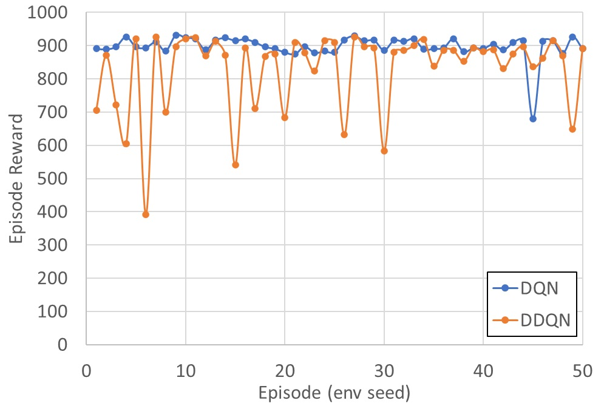

# DQN-Car-Racing
Implementation of the original Deep Q-learning Network (DQN) [1] and Double Deep Q-learning Network (DDQN) [2] to play the Car Racing game in the set up OpenAI Gymnasium environment [3].
<p align='center'>

</p>

# Problem Formulation
The Car Racing game scenario involves a racing environment represented by a closed-loop track, wherein an autonomous agent maneuvers a racing car. The track is comprised of fixed-width tiles and situated within a defined field with discernible boundaries. The primary objective of the game is to efficiently traverse each track tile in the shortest possible time. Termination of an episode occurs upon visiting all tiles, exiting the playfield, or reaching a predefined frame limit of one thousand frames.<br>

The run example given in the gif is rendered in full-scale mode i.e., that is what a human sees playing this game. However, by the default settings, OpenAI Gymnasium learning environment produces a top-down 96x96 RGB image capturing the car's position and the racetrack configuration to characterize the state. Additionally, the state encompasses a set of parameters, including vehicle speed, individual ABS sensor readings for each wheel, steering wheel position, and gyroscope data presented as a set of bar indicators in the bottom part of an image.<br>

<p align='center'>

</p>

However, the produced frames are modified before further processing. They are transformed from an RGB state representation to grayscale, and the resolution is downscaled to 84x84 pixels. These steps facilitate the network computations making them less complex. Furthermore, to enable the network to track the car dynamics correctly and better adjust agent actions to a current state, every consecutive frame is stacked with other three preceding frames. Hence, every state is represented by a series of four consecutive grayscale frames of 84x84 resolution. A state example is demonstrated in the figure above. A transition from one state to another is performed by adding a new frame on top of the stack and discarding the most distant one.<br>

# Description
### Network
With the abovementioned formulation, the problem lays in the domain of enormously large image-state space and small discrete action space. For this type of problems, DQN and DDQN are viable methods to obtain a solution. They were designed to learn an environment from an image and make decisions on a set of several options. Reinforcement learning, rooted in Markov Decision Processes, posits an agent interacting with an environment to optimize cumulative rewards. DQN and DDQN emerge as a solution to the challenges posed by high-dimensional state spaces, leveraging deep neural networks to approximate Q-values, which quantify the quality of actions in a given state.<br>

DQN and Double DQN are represented by a convolutional neural networks. The models, in fact, includes two CNNs with the same architecture. One of them is named an online network, and another one is a target network. Training a network in an off-policy manner, utilizing bootstrapping and non-linear function approximation can lead to instability and divergence of the model with high probability. To mitigate the challenges associated with training instability, DQN introduces a target Q-network. This secondary neural network, with generally frozen parameters, facilitates the generation of target Q-values during the training process. The main Q-network continuously updates its weights and, to keep the target Q-network in alignment, periodically synchronizes the frozen parameters with the updating counterparts once in several time steps, contributing to a more robust learning process.<br>

<p align='center'>

</p>

The training of the model involves optimizing a loss function, specifically the L1 smooth temporal difference error between predicted Q-values and target Q-values. The training is performed on minibatches of state-action-reward-new state sequences extracted from the replay buffer. While all other method aspects are the same for both DQN and DDQN, the main difference between them is concluded in the approach to calculation of this error. Both networks use the target network to calculate the target action value. If the next state is not terminal, DQN evaluates the target value of current action as the experienced reward added by the discounted maximum action value of the next state.<br>

```math
y_j^{DQN}=\left\{\begin{matrix}R_j&if\ S_j^\prime\ is\ terminal\\R_j+\gamma\max_{a^\prime}{Q\left(S_j^\prime,a^\prime,\theta_t\right)}&otherwise\\\end{matrix}\right.
```

At the same time, following DDQN method of calculation of the current action target value, the action for the next state is produced by the online network.
$$A_j^\prime={\rm argmax}_{a^\prime}\ Q\left(S_j^\prime,a^\prime,\theta_o\right)$$

Then the next state is evaluated by the target network, and, from the set of produced action values, the value corresponding to the chosen action is used to calculate the target value of the current action.<br>

```math
y_j^{DDQN}=\left\{\begin{matrix}R_j&ifS_j^\prime\ is\ terminal\\R_j+\gamma Q\left(S_j^\prime,A_j^\prime,\theta_t\right)&otherwise\\\end{matrix}\right.
```

As it can be observed, the maximization bias is eliminated from the value estimation of the current action in this case. Moreover, whilst the double Q-learning tabular method requires having a second action estimate, DDQN does not introduce additional complexity in the DQN algorithm because DQN is built on two networks itself.<br>

Further loss calculation is performed in the same way regardless of the algorithm. The loss is calculated as L1 smooth loss with β parameter equal to 1.<br>
```math
L_j=\left\{\begin{matrix}\frac{1}{2}\left(y_j-Q\left(S_j,A_j,\theta_o\right)\right)^2&if\ \left|y_j-Q\left(S_j,A_j,\theta_o\right)\right|<1\\\left|y_j-Q\left(S_j,A_j,\theta_o\right)\right|-\frac{1}{2}&otherwise\\\end{matrix}\right.
```

Backpropagation and stochastic gradient descent drive the neural network towards convergence to an optimal policy.<br>

### Replay Buffer
One of the important aspects of reading environment states from frames of a videogame is that consecutive frames are very similar. That is, the difference between neighbouring states may be subtle, and the correlation between them could be very high. Whereas training of a deep neural network requires a large amount of independent identically distributed data samples. Learning on highly correlated data is inefficient and infuses biases into a model. One of the major innovations introduced by the original DQN paper is the concept of experience replay. This mechanism involves storing past experiences in a replay memory buffer, enabling the agent to break temporal correlations between consecutive experiences. During training, random minibatches of experiences are sampled from this buffer, enhancing the stability of the learning process.<br>


# Results

### Training
The training was carried out for 3000 game episodes for each model. In its maximum length, an episode consists of 1000 frames, and, considering the mentioned frame-skipping method, agents can take up to 250 actions per episode at maximum. Therewith, an episode could be terminated earlier if all the track tiles are collected i.e., the game end goal is achieved, or an agent goes beyond the game defined area.<br>

<p align='center'>


</p>

Training statistics of DQN and DDQN models.
<p align='center'>

Model | Number of episodes | Number of taken actions
| :------: | :------: | :------: |
DQN | 3000 | 740188 
DDQN | 3000 | 743550

</p>

### Evaluation
The evaluation was performed on 50 game episodes. Each of 50 episodes represents a racetrack of unique configuration, but the set of tracks was common for DQN and DDQN. So, the models were tested in exactly the same environment.<br>

<p align='center'>

</p>

Performance evaluation of DQN and DDQN models. Statistics of the reward over 50 episodes.
<p align='center'>

Model | Completed episodes | Minimum | Maximum | Median | Mean | Standard Deviation
| :------: | :------: | :------: | :------: | :------: | :------: | :------: |
DQN | 48% | 679.37 | 931.60 | 897.03 | 898.17 | 35.54
DDQN | 24% | 392.40 | 926.00 | 880.06 | 830.16 | 118.85

</p>

The obtained results of training and evaluation allow to conclude that the maximization bias of DQN approach does not exhibits itself at early stages of training and leave the results unaffected. During the training phase, the DQN model advances in performance, reaches the stable value of high reward and maintains it until the very end of process. The decrease which is usually inherent to maximization error is not observed here. This type of error has a cumulative characteristic, it grows as the training proceeds. By the achieved point, the critical value of it is not reached, so the performance remains uninfluenced. At the same time, an optimistic action estimate enables faster approaching the target action value, while conservative action value estimate of DDQN results in a slight lagging behind in terms of developed performance.<br>

# Code Usage Instructions
1. Use Python 3.9.
2. Install a CUDA version of PyTorch 2.1 
3. Install other libraries from the requirements.
4. Modify model parameters and saving paths in the model. 
5. Run the import code cell.
6. Run a task specific code cell.

# References
[1] V. Mnih et al., "Human-level control through deep reinforcement learning”, Nature, vol. 518, pp. 529–533, 2015. DOI: 10.1038/nature14236.<br>
[2] H. van Hasselt, A. Guez, and D. Silver, "Deep reinforcement learning with double Q-Learning”, in Proceedings of the Thirtieth AAAI Conference on Artificial Intelligence (AAAI'16), AAAI Press, 2016, pp. 2094–2100.<br>
[3] M. Towers et al., "Gymnasium”, Zenodo, 2023. DOI: 10.5281/zenodo.8127026.
